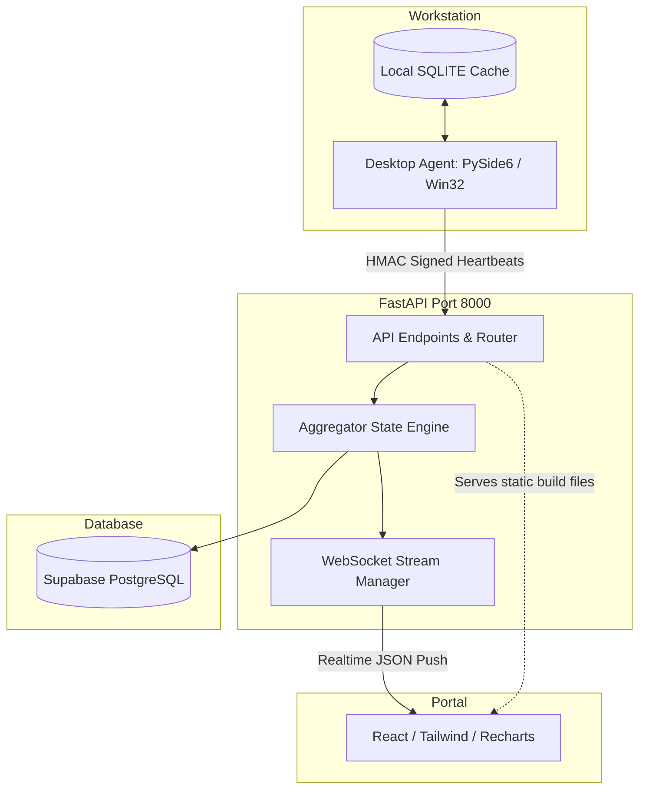

# ControlSense: Employee Monitoring Tool (A to Z Documentation)

Welcome to the complete documentation guide for the **ControlSense Employee Monitoring & Analytics Platform**. This document covers system features, database architecture, installation, packaging, and testing workflows.

---

## 📌 1. Project Overview

ControlSense is an enterprise-grade employee time-tracking and digital well-being intelligence suite consisting of three core components:
1. **Desktop Tracker Client (Agent):** A background application that runs on employee workstations. It monitors active window titles, process names, URL domains (Chrome/Edge), and keyboard/mouse idle states.
2. **FastAPI Backend Server:** Receives securely signed heartbeats, classifies process activities in real-time, pushes events via WebSockets, and persists logs to Supabase.
3. **Admin Web Dashboard:** A dark-themed React SPA (Single Page Application) that gives managers real-time workstation visual grids, daily/weekly/monthly statistics, warning center alerts, and 7-day productivity charts.

---

## 🏗️ 2. System Architecture



---

## 🔒 3. HMAC Security & Telemetry Ingestion

To prevent employees from manually sending fake telemetry requests, every heartbeat payload is cryptographically signed using **HMAC-SHA256**:
* **Payload Fields:** `full_name`, `email`, `role`, `process_name`, `window_title`, `domain_url`, `category`, `is_idle`, `interval_seconds`.
* **Headers:**
  * `X-Timestamp`: The UTC timestamp when the log was generated.
  * `X-Signature`: Hex digest computed using `hmac(secret_key, "email:timestamp:process_name")`.
* **Replay Attack Protection:** The backend rejects any heartbeat with an `X-Timestamp` older than **90 seconds** compared to the server's clock.

---

## 💾 4. Database Schema (Supabase PostgreSQL)

The database schema is streamlined to track only the critical entities (`employees` and `activity_logs`) to prevent foreign key issues and maintain top performance.

```sql
-- 1. Enable UUID Extension
CREATE EXTENSION IF NOT EXISTS "uuid-ossp";

-- 2. Employees Table
CREATE TABLE employees (
    id UUID PRIMARY KEY DEFAULT uuid_generate_v4(),
    full_name VARCHAR(100) NOT NULL,
    email VARCHAR(150) UNIQUE NOT NULL,
    role VARCHAR(100),
    created_at TIMESTAMPTZ DEFAULT NOW()
);

-- 3. Activity Logs Table
CREATE TABLE activity_logs (
    id UUID PRIMARY KEY DEFAULT uuid_generate_v4(),
    employee_id UUID REFERENCES employees(id) ON DELETE CASCADE NOT NULL,
    process_name VARCHAR(100) NOT NULL,
    window_title TEXT,
    domain_url VARCHAR(255),
    category VARCHAR(50) NOT NULL,
    is_idle BOOLEAN DEFAULT FALSE,
    duration_seconds INTEGER DEFAULT 5,
    recorded_at TIMESTAMPTZ DEFAULT NOW()
);

-- 4. 30-Day Automated Data Retention Trigger
CREATE OR REPLACE FUNCTION clean_old_activity_logs()
RETURNS trigger AS $$
BEGIN
  DELETE FROM activity_logs WHERE recorded_at < NOW() - INTERVAL '30 days';
  RETURN NEW;
END;
$$ LANGUAGE plpgsql;

CREATE TRIGGER trigger_clean_old_logs
AFTER INSERT ON activity_logs
EXECUTE FUNCTION clean_old_activity_logs();
```

---

## ⚙️ 5. Activity Classification Rules

The server categorizes heartbeats into one of four buckets based on process name and browser window matching rules:
* **`CORE_WORK` (Productive):** Matching developer/office tools (e.g. `VS Code`, `PyCharm`, `Figma`, `Microsoft Word`, `Slack`).
* **`PRODUCTIVE` (General Work):** Generic business software (e.g. browser windows containing work domains like CRM software).
* **`ENTERTAINMENT` (Unproductive):** Watching streaming apps (e.g. browser tabs containing `youtube.com`, `netflix.com`, `twitch.tv`, `instagram.com`).
* **`NEUTRAL` (Default):** Generic OS processes (e.g. file explorer, desktop settings).

---

## 🖥️ 6. Admin Web Dashboard Features

### 4x KPI Metric Cards (Top Section)
* **Active Stations:** Number of connected clients sending heartbeats in the last 20 seconds.
* **Avg Productivity:** Mean score computed across the entire active team today.
* **Team Work Hours:** Cumulative clock time logged across all employees today.
* **Active Red Flags:** Number of active unresolved alerts. *Clicking this card opens the alerts manager popup.*

### Live Workstation Grid (Middle Section)
* Visual cards representing each employee showing their initials badge, position, current status (blinking red for YouTube, orange for Idle, green for Active), and active window title.
* *Clicking a card opens the Employee Detail Modal.*

### Segmented Detail Modal (Pop-up)
* Contains tabs for **Daily**, **Weekly**, and **Monthly** intervals.
* Fetches historical logs from Supabase for weekly/monthly modes, recalculating focused applications distributions, active hours, and timeline events dynamically.
* If **Daily** is active, updates in real-time as WebSocket heartbeats stream in.

### Analytics Trends (Bottom Section)
* **Work Hours Trend (Bar Chart):** Displays total logged hours for the past 7 days.
* **Productivity Score (Area Chart):** Displays average productivity percentages for the past 7 days.

---

## 🚀 7. Installation & Deployment Guide

### Setup Backend Environment
1. Install Python 3.10+.
2. Install dependencies:
   ```bash
   cd backend
   pip install -r requirements.txt
   ```
3. Set your environment variables (in your system variables or a `.env` file):
   ```env
   SUPABASE_URL=https://your-project.supabase.co
   SUPABASE_KEY=your-supabase-service-role-key
   API_SECRET_KEY=SuperSecretTokenSignatureKey123!
   ```
4. Start the backend:
   ```bash
   python main.py
   ```
   *The FastAPI server will launch and listen on `http://localhost:8000`.*

### Build Frontend
1. Open a new terminal inside the `frontend` folder.
2. Compile Vite static assets:
   ```bash
   npm run build
   ```
   *This compiles files into `frontend/dist/`. The backend will automatically detect this folder and host the website directly on port 8000.*

---

## 📦 8. Compiling Desktop Agent Binaries

### 1. Compile Agent to a Standalone Executable (.exe)
We use PyInstaller to compile the python files (`agent.py`, `ui_agent.py`) into a single executable that doesn't show a command prompt shell window:
```bash
cd desktop_agent
python build_exe.py
```
*This generates a standalone binary in `desktop_agent/dist/ControlSenseTracker.exe`.*

### 2. Generate setup installer (.exe)
We use Inno Setup to create a standard Windows wizard installer (`ControlSenseTracker_Setup.exe`):
1. Open Inno Setup Compiler.
2. Compile the `setup_script.iss` configuration file.
3. This creates a ready-to-distribute installer in the `desktop_agent/Output/` folder which handles program files placement, start menu shortcuts, and auto-startup registries.

---

## 🧪 9. Testing Features

### Triggering Distraction Alerts
1. Open the desktop tracker agent, enter a name, email, and position, and click **Start Tracking**.
2. Open Google Chrome and go to `youtube.com`. Watch a video.
3. In **[`backend/services/aggregator.py`](file:///c:/Users/aviar/Desktop/Employee%20monitoring%20tool/backend/services/aggregator.py#L258)**, you can change the threshold from `1800` seconds to `60` seconds for quick testing.
4. After 1 minute of streaming, a red alert notification will pop up on your dashboard.

### Testing Offline Mode
1. Disconnect your computer's internet connection.
2. Notice the desktop agent stays active and starts buffering heartbeats locally in its SQLite cache.
3. Reconnect the internet.
4. The tracker agent will automatically flush the cached buffer back to the server, preserving the employee's logged hours.
